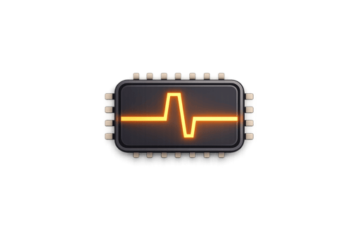

# Pulse

**Pulse** is a cycle-accurate Nintendo Entertainment System emulator built from the ground up to
leverage the performance and memory safety of the Zig programming language. It focuses on technical
transparency and minimalist architecture, serving as both a functional gaming platform and a modern
exploration of the 2A03 system architecture.

## License

This project is licensed under the MIT License — see the [LICENSE](./LICENSE) file for details.

SPDX-License-Identifier: MIT
